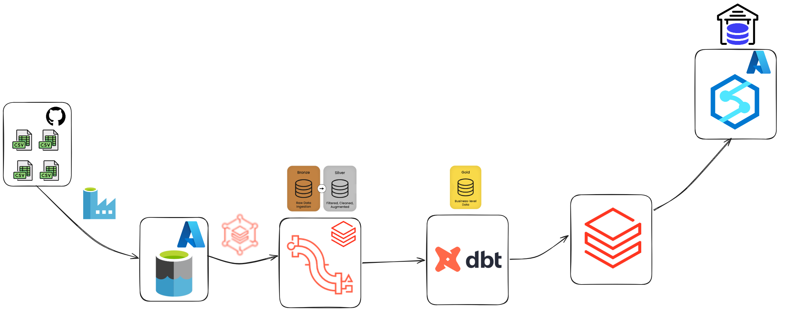
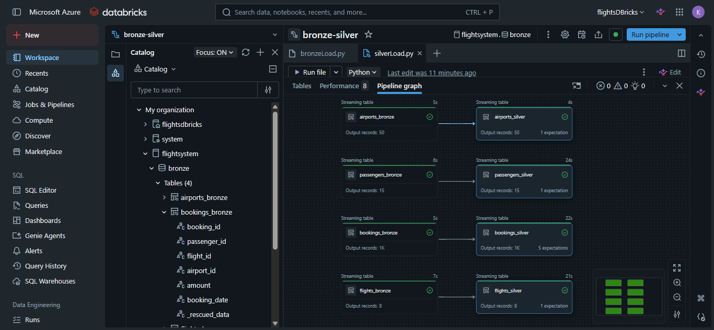
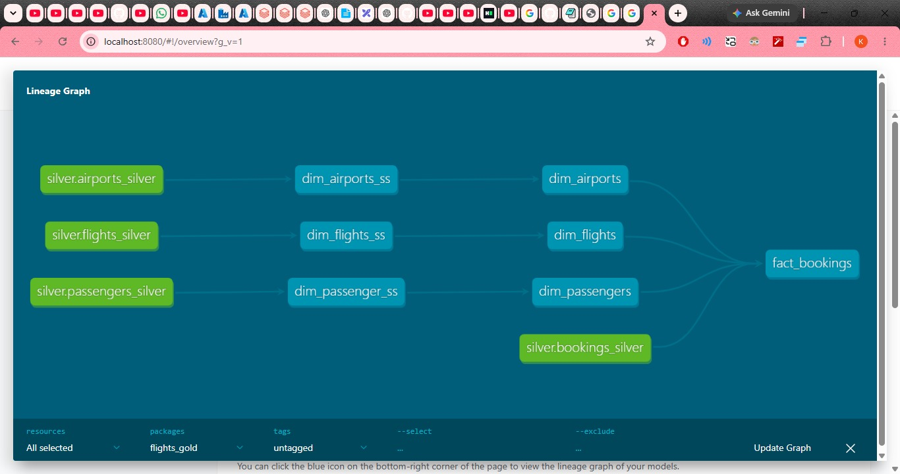
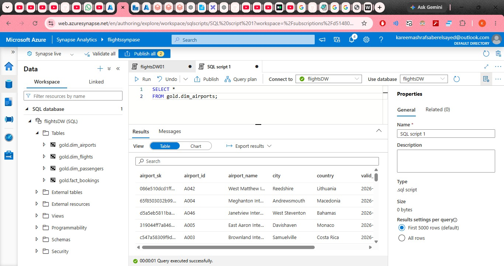

# ✈️ Flight Booking Data Engineering Platform

An end-to-end Azure data engineering project that ingests flight booking data from CSV sources, lands it in Azure Data Lake Storage Gen2, processes it through Bronze and Silver layers in Databricks, builds a business-ready Gold layer with dbt, and delivers the final dimensional model to an Azure Synapse SQL warehouse.



## Architecture

```text
CSV / GitHub
     │
     ▼
Azure Data Factory
     │
     ▼
Azure Data Lake Storage Gen2
     │
     ▼
Databricks Lakeflow Declarative Pipelines
     │
     ├── Bronze
     │     └── Raw structured ingestion
     │
     └── Silver
           └── Cleaning, validation, transformation
                    │
                    ▼
                   dbt
                    │
                    └── Gold
                         ├── dim_airports
                         ├── dim_flights
                         ├── dim_passengers
                         └── fact_bookings
                                  │
                                  ▼
                             Databricks
                                  │
                                  ▼
                         Azure Synapse Analytics
                                  │
                                  ▼
                              flightsDW
```

The project follows a **Medallion Architecture**:

```text
Bronze → Silver → Gold
```

Bronze and Silver are implemented in Databricks using Lakeflow Declarative Pipelines, while the Gold layer is modeled using dbt.

---

## Technology Stack

- **Azure Data Factory** — source ingestion and data movement
- **Azure Data Lake Storage Gen2** — raw data landing and storage
- **Azure Databricks** — lakehouse processing
- **Lakeflow Declarative Pipelines** — Bronze/Silver pipeline management
- **Delta Lake** — reliable lakehouse table storage
- **PySpark** — data transformation
- **dbt** — Gold-layer dimensional modeling
- **dbt Snapshots** — SCD Type 2 historical tracking
- **Azure Synapse Analytics** — analytical SQL warehouse
- **SQL / Python**
- **Git / GitHub**

---

## 1. Data Ingestion

The source data consists of CSV files representing the flight booking domain:

- Airports
- Passengers
- Flights
- Bookings

Azure Data Factory is responsible for ingesting the source files and moving them into Azure Data Lake Storage Gen2.

```text
Source CSV Files
       │
       ▼
Azure Data Factory
       │
       ▼
Azure Data Lake Storage Gen2
```

ADF is used as the ingestion/orchestration component, while Databricks handles the downstream processing.

---

## 2. Bronze Layer

The Bronze layer provides the raw structured representation of the data after it has been landed in the lake.

The Bronze tables are:

```text
flightsystem.bronze.airports_bronze
flightsystem.bronze.passengers_bronze
flightsystem.bronze.flights_bronze
flightsystem.bronze.bookings_bronze
```

The Bronze layer intentionally stays close to the source data. Heavy business transformations are not performed here.

Its purpose is to provide a reliable starting point for downstream processing while preserving the ingested data.

```text
ADLS
 │
 ▼
Bronze
 ├── airports_bronze
 ├── passengers_bronze
 ├── flights_bronze
 └── bookings_bronze
```

---

## 3. Silver Layer

The Silver layer contains cleaned, standardized, validated, and transformed datasets.

The Silver tables are:

```text
flightsystem.silver.airports_silver
flightsystem.silver.passengers_silver
flightsystem.silver.flights_silver
flightsystem.silver.bookings_silver
```

Transformations performed in this layer include:

- Data type casting
- Data cleansing
- Standardization
- Validation
- Data quality expectations
- Handling invalid data
- Preparing trusted datasets for downstream modeling

The transformation flow is:

```text
Bronze
  │
  ▼
Cleaning
  │
  ▼
Validation
  │
  ▼
Silver
```

### Databricks Pipeline

The Bronze-to-Silver dependencies are managed through a Databricks Lakeflow Declarative Pipeline.



The pipeline contains separate flows for airports, passengers, flights, and bookings.

Data quality expectations are applied to the Silver datasets so that invalid records can be detected and handled before the data reaches the Gold layer.

---

## 4. dbt Gold Layer

Once the Silver layer is available, dbt is used to build the business-facing Gold layer.

The dbt project consumes the Silver tables as sources and transforms them into a dimensional model.

The main Gold models are:

```text
dim_airports
dim_flights
dim_passengers
fact_bookings
```

The dbt lineage follows the general pattern:

```text
silver.airports_silver
        │
        ▼
dim_airports_ss
        │
        ▼
dim_airports
        │
        └──────────────┐

silver.flights_silver │
        │              │
        ▼              │
dim_flights_ss         │
        │              │
        ▼              │
dim_flights ───────────┤

silver.passengers_silver
        │              │
        ▼              │
dim_passenger_ss       │
        │              │
        ▼              │
dim_passengers ────────┤

silver.bookings_silver
        │              │
        └──────────────┤
                       ▼
                 fact_bookings
```



The intermediate `*_ss` models provide the transformation stage between the Silver sources and the final dimensional models.

---

## 5. Slowly Changing Dimensions — SCD Type 2

The Gold layer uses **Slowly Changing Dimension Type 2** to preserve historical changes to dimension records.

Instead of overwriting an existing record when an attribute changes, the previous version is closed and a new version is created.

For example:

```text
Passenger 1001
City = Alexandria
Valid From = 2026-01-01
Valid To   = 2026-07-15
```

After the passenger changes city:

```text
Passenger 1001
City = Alexandria
Valid From = 2026-01-01
Valid To   = 2026-07-15

Passenger 1001
City = Cairo
Valid From = 2026-07-15
Valid To   = NULL
```

This allows historical analysis to use the dimension state that was valid when a booking occurred.

### dbt Snapshots

dbt snapshots are used to detect changes and maintain historical versions.

Snapshot metadata includes:

```text
dbt_scd_id
dbt_valid_from
dbt_valid_to
```

The snapshot therefore provides the historical foundation for the final dimension models.

---

## 6. Surrogate Keys

The dimensional models use surrogate keys to uniquely identify individual historical versions of an entity.

A business entity can therefore have multiple dimension records:

```text
Passenger ID = P100

Version 1 → passenger_sk = A
Version 2 → passenger_sk = B
Version 3 → passenger_sk = C
```

The business key identifies the entity, while the surrogate key identifies a specific historical version.

This is important when joining the booking fact table to an SCD Type 2 dimension.

---

## 7. Star Schema

The final Gold layer follows a star-schema design.

```text
                    dim_passengers
                           │
                           │
                           ▼
dim_airports ───────► fact_bookings ◄─────── dim_flights
```

### Dimensions

```text
dim_airports
dim_flights
dim_passengers
```

### Fact

```text
fact_bookings
```

The fact table contains booking-level transactional data and references the dimensions through surrogate keys.

```text
fact_bookings
│
├── passenger_sk ──► dim_passengers
├── flight_sk ─────► dim_flights
└── airport_sk ────► dim_airports
```

---

## 8. Historical Fact-to-Dimension Joins

Because the dimensions use SCD Type 2, joining a booking to a dimension requires both the business key and the dimension validity period.

Conceptually:

```sql
booking.business_id = dimension.business_id

AND booking.booking_date >= dimension.valid_from

AND (
    booking.booking_date < dimension.valid_to
    OR dimension.valid_to IS NULL
)
```

This ensures that a booking references the dimension version that was valid at the time of the booking rather than simply using the current version.

---

## 9. Final Gold Model

The final business-ready tables are:

```text
gold.dim_airports
gold.dim_flights
gold.dim_passengers
gold.fact_bookings
```

At this stage the data has passed through:

```text
Raw ingestion
     ↓
Data cleaning
     ↓
Data quality validation
     ↓
Dimensional modeling
     ↓
Historical tracking
     ↓
Star-schema relationships
```

The Gold layer is therefore designed for analytical consumption rather than raw operational processing.

---

## 10. Databricks → Azure Synapse

The final Gold model is delivered to Azure Synapse Analytics.

The Synapse SQL database is:

```text
flightsDW
```

The final warehouse tables are:

```text
gold.dim_airports
gold.dim_flights
gold.dim_passengers
gold.fact_bookings
```

The serving flow is:

```text
Databricks Gold
      │
      ├── dim_airports
      ├── dim_flights
      ├── dim_passengers
      └── fact_bookings
               │
               ▼
       Azure Synapse Analytics
               │
               ▼
           flightsDW
```

### Synapse Validation

The final warehouse was validated by querying the Gold tables directly from Synapse.

Example:

```sql
SELECT *
FROM gold.dim_airports;
```



This confirms that the final dimensional data is available in the Synapse SQL warehouse.

---

## 11. End-to-End Lineage

```text
Source CSV Files
       │
       ▼
Azure Data Factory
       │
       ▼
Azure Data Lake Storage Gen2
       │
       ▼
Databricks Bronze
       │
       ▼
Databricks Silver
       │
       ▼
dbt
       │
       ├── SCD Type 2
       ├── Surrogate Keys
       ├── Dimensions
       └── Fact Model
       │
       ▼
Databricks Gold
       │
       ▼
Azure Synapse Analytics
       │
       ▼
flightsDW
```

---

## 12. ETL / ELT Approach

The project combines ETL and ELT characteristics.

ADF handles the ingestion and movement of source data:

```text
Source
  ↓
ADF
  ↓
ADLS
```

Transformations then occur after the data has been landed in the data lake:

```text
ADLS
  ↓
Databricks Bronze
  ↓
Databricks Silver
  ↓
dbt Gold
```

Therefore, the overall solution is best described as a **hybrid cloud ETL/ELT pipeline**.

The raw data is first landed in the lake and then transformed within the data platform.

---

## 13. Why the Architecture Is Split This Way

Each component has a specific responsibility:

| Component | Responsibility |
|---|---|
| Azure Data Factory | Ingestion and data movement |
| Azure Data Lake Storage | Raw data landing and storage |
| Databricks Bronze | Raw structured ingestion |
| Databricks Silver | Cleaning, validation, and transformation |
| Lakeflow Declarative Pipelines | Bronze/Silver pipeline management |
| dbt | Gold dimensional modeling |
| dbt Snapshots | SCD Type 2 history |
| Databricks Gold | Business-ready analytical model |
| Azure Synapse | Final SQL warehouse |

This separation keeps ingestion, transformation, modeling, and serving concerns independent.

It also makes the pipeline easier to troubleshoot because data can be traced through each layer.

---

## 14. Project Structure

```text
flight-booking-data-engineering/
│
├── screenshots/
│   ├── architecture.png
│   ├── databricks_pipeline.png
│   ├── dbt_lineage.png
│   └── synapse_table.png
│
├── adf/
│   └── ...
│
├── databricks/
│   ├── bronze/
│   │   └── bronzeLoad.py
│   │
│   └── silver/
│       └── silverLoad.py
│
├── dbt/
│   └── flights_gold/
│       ├── models/
│       ├── snapshots/
│       ├── macros/
│       ├── tests/
│       └── dbt_project.yml
│
└── README.md
```

---

## 15. Key Engineering Concepts

This project demonstrates practical implementation of:

- Azure Data Factory ingestion
- Azure Data Lake Storage Gen2
- Databricks Lakehouse
- Medallion Architecture
- Bronze and Silver layers
- Lakeflow Declarative Pipelines
- Delta Lake
- PySpark transformations
- Data quality expectations
- dbt models and sources
- dbt lineage
- dbt snapshots
- Slowly Changing Dimensions Type 2
- Surrogate keys
- Historical dimension tracking
- Fact and dimension modeling
- Star schema design
- Hybrid ETL/ELT architecture
- Azure Synapse Analytics
- SQL data warehousing
- End-to-end data lineage

---

## Final Result

The project takes raw flight booking data and progressively turns it into a clean, validated, historized, dimensional data model that can be consumed through a SQL warehouse.

```text
CSV
 ↓
ADF
 ↓
ADLS
 ↓
Databricks Bronze
 ↓
Databricks Silver
 ↓
dbt Gold
 ↓
Databricks
 ↓
Synapse Warehouse
```

The final analytical model consists of:

```text
gold.dim_airports
gold.dim_flights
gold.dim_passengers
gold.fact_bookings
```

with **SCD Type 2 historical tracking**, **surrogate keys**, **data quality validation**, and a **star-schema design**.
